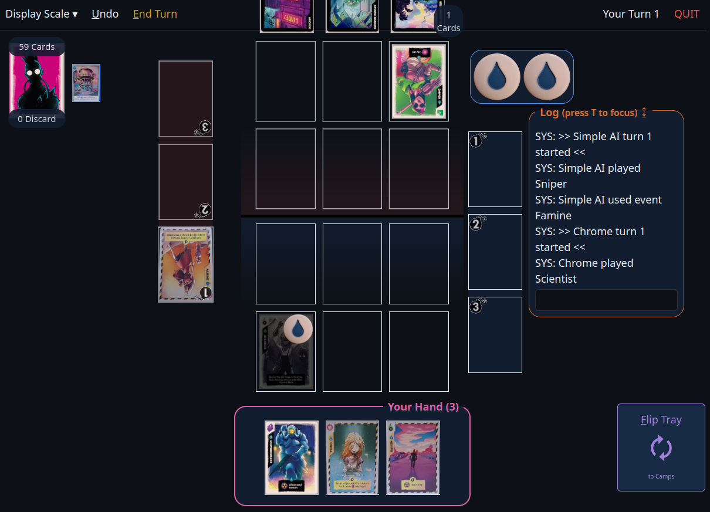

# Badlands Online

This is an unlicensed fan made adaptation of the amazing [Radlands](https://boardgamegeek.com/boardgame/329082/radlands) card
game

Can see the live running version at 🔗[https://badlands.deno.dev/](https://badlands.deno.dev/)🔗

Built with [Deno](https://deno.com/) and [Alpine.js](https://alpinejs.dev/) and a _lot_ of manual Websocket messaging.
Launching steps:

1. [Install Deno v2+](https://docs.deno.com/runtime/getting_started/installation/)
2. From the root directory execute `deno run dev`
3. Navigate to [`http://localhost:2000`](http://localhost:2000)

Check out `utils.mjs` for a bunch of `DEBUG_*` flags to toggle the learning/testing experience. Can also lint from the main
directory with `deno fmt ; deno lint`

Obviously see the [Issues](https://github.com/horizoncarlo/badlands-online/issues) list for progress and ideas. Tons of TODOs
scattered throughout the code too.
